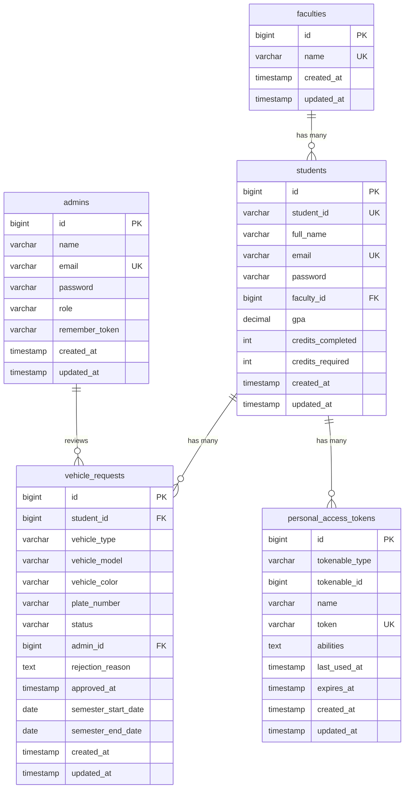

# Database Schema

## Overview

The IAAS backend uses **MySQL** with the database name `iaas_db`. The schema consists of 5 tables (4 application tables + 1 Sanctum token table).

## Entity Relationship Diagram

---

## Tables

### 1. `admins`

**Purpose**: Stores admin accounts for the Filament dashboard.

| Column | Type | Nullable | Description |
|--------|------|----------|-------------|
| `id` | bigint (PK) | No | Auto-increment primary key |
| `name` | varchar(255) | No | Admin full name |
| `email` | varchar(255) | No | Unique login email (used for Filament login) |
| `password` | varchar(255) | No | Bcrypt hashed password |
| `role` | varchar(255) | No | One of: `super_admin`, `academic_admin`, `vehicle_admin`, `support_admin` |
| `remember_token` | varchar(100) | Yes | Session remember-me token (used by Filament) |
| `created_at` | timestamp | Yes | Record creation time |
| `updated_at` | timestamp | Yes | Record update time |

**Indexes**: `email` (unique)

**Notes**:
- `admins.email` is used for Filament login (not student_id).
- `admins.password` is automatically hashed by the model's `hashed` cast.
- The account `admin@galala.edu.eg` is the protected root super admin.

---

### 2. `faculties`

**Purpose**: Stores university faculties/colleges.

| Column | Type | Nullable | Description |
|--------|------|----------|-------------|
| `id` | bigint (PK) | No | Auto-increment primary key |
| `name` | varchar(255) | No | Faculty name (unique) |
| `created_at` | timestamp | Yes | Record creation time |
| `updated_at` | timestamp | Yes | Record update time |

**Indexes**: `name` (unique)

**Seeded Faculties** (9):
Engineering, Computer Science, Business, Medicine, Dentistry, Pharmacy, Nursing, Art and Design, Administrative Sciences

---

### 3. `students`

**Purpose**: Stores student accounts for API authentication and profile data.

| Column | Type | Nullable | Description |
|--------|------|----------|-------------|
| `id` | bigint (PK) | No | Auto-increment primary key |
| `student_id` | varchar(255) | No | University student ID (unique, used for API login) |
| `full_name` | varchar(255) | No | Student's full name |
| `email` | varchar(255) | No | Unique email address |
| `password` | varchar(255) | No | Bcrypt hashed password |
| `faculty_id` | bigint (FK) | No | References `faculties.id` (cascade on delete) |
| `gpa` | decimal(3,2) | No | Grade point average (0.00–4.00), default 0 |
| `credits_completed` | integer | No | Credits completed, default 0 |
| `credits_required` | integer | No | Total credits required for graduation, default 0 |
| `created_at` | timestamp | Yes | Record creation time |
| `updated_at` | timestamp | Yes | Record update time |

**Indexes**: `student_id` (unique), `email` (unique)

**Notes**:
- `students.student_id` is used for API login (not email).
- `students.password` is automatically hashed by the model's `hashed` cast.
- Students are created by admins through Filament. There is no self-registration.

---

### 4. `vehicle_requests`

**Purpose**: Stores vehicle access permit requests submitted by students via the API.

| Column | Type | Nullable | Description |
|--------|------|----------|-------------|
| `id` | bigint (PK) | No | Auto-increment primary key |
| `student_id` | bigint (FK) | No | References `students.id` (cascade on delete) |
| `vehicle_type` | varchar(255) | No | Type of vehicle (e.g., Car, Motorcycle) |
| `vehicle_model` | varchar(255) | No | Vehicle model (e.g., Toyota Corolla) |
| `vehicle_color` | varchar(255) | No | Vehicle color |
| `plate_number` | varchar(255) | No | License plate number |
| `status` | varchar(255) | No | One of: `pending`, `approved`, `rejected` (default: `pending`) |
| `admin_id` | bigint (FK) | Yes | References `admins.id` — the admin who reviewed the request |
| `rejection_reason` | text | Yes | Reason for rejection (set when rejected) |
| `approved_at` | timestamp | Yes | Timestamp of approval |
| `semester_start_date` | date | Yes | Start of permit validity (set when approved) |
| `semester_end_date` | date | Yes | End of permit validity (set when approved) |
| `created_at` | timestamp | Yes | Request submission time |
| `updated_at` | timestamp | Yes | Record update time |

**Indexes**: Composite index on `(student_id, status)`

**Status Values**:
| Status | Meaning |
|--------|---------|
| `pending` | Submitted, awaiting admin review |
| `approved` | Approved by admin, valid between semester dates |
| `rejected` | Rejected by admin with a reason |

---

### 5. `personal_access_tokens`

**Purpose**: Laravel Sanctum token storage for student API authentication.

| Column | Type | Nullable | Description |
|--------|------|----------|-------------|
| `id` | bigint (PK) | No | Auto-increment primary key |
| `tokenable_type` | varchar(255) | No | Model class (e.g., `App\Models\Student`) |
| `tokenable_id` | bigint | No | Model ID |
| `name` | varchar(255) | No | Token name (e.g., `student-api-token`) |
| `token` | varchar(64) | No | SHA-256 hashed token (unique) |
| `abilities` | text | Yes | Token abilities/scopes |
| `last_used_at` | timestamp | Yes | Last usage timestamp |
| `expires_at` | timestamp | Yes | Expiration timestamp |
| `created_at` | timestamp | Yes | Token creation time |
| `updated_at` | timestamp | Yes | Token update time |

**Indexes**: `token` (unique), composite on `(tokenable_type, tokenable_id)`

**Notes**: This table is managed automatically by Laravel Sanctum. Tokens are created on login and deleted on logout.

---

## Relationships Summary

| Relationship | Type | Description |
|--------------|------|-------------|
| Faculty → Students | One to Many | A faculty has many students |
| Student → Faculty | Many to One | A student belongs to one faculty |
| Student → VehicleRequests | One to Many | A student can have many vehicle requests |
| VehicleRequest → Student | Many to One | A vehicle request belongs to one student |
| VehicleRequest → Admin | Many to One | A reviewed vehicle request has one reviewing admin |
| Admin → VehicleRequests | One to Many | An admin can review many vehicle requests |
| Student → PersonalAccessTokens | Polymorphic One to Many | Sanctum tokens for API auth |
